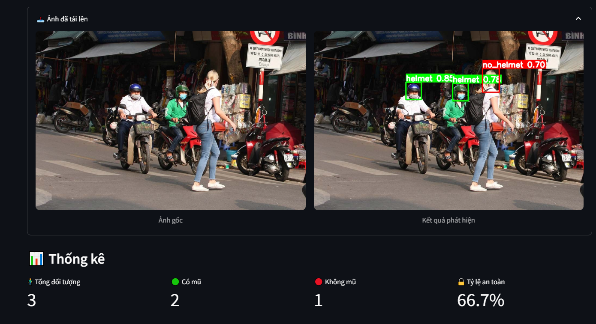
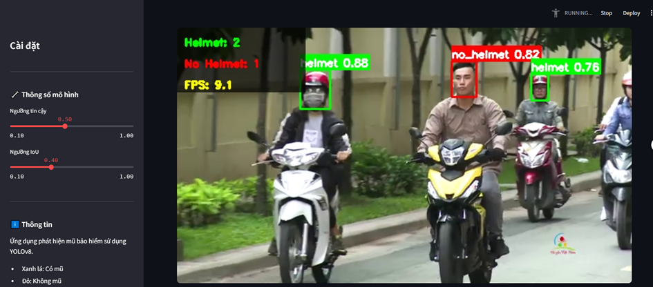

# Đồ án tốt nghiệp 2025 - Nguyễn Văn Nghĩa - CNTT3-K62 - UTC

Ứng dụng Học sâu trong nhận diện hành vi **không đội mũ bảo hiểm** khi tham gia giao thông bằng YOLO11 và deploy bằng Streamlit

---

## 🧠 Tính năng chính

✅ Nhận diện hành vi **không đội mũ bảo hiểm**  
🎥 Xử lý **ảnh, video** theo thời gian thực  
📁 Tự động lưu ảnh kết quả và báo cáo  
⚡ Sử dụng **YOLO11** tốc độ cao và chính xác  
🧩 Giao diện đơn giản, dễ dùng với **Streamlit**

---

## 📁 Cấu trúc dự án

```
HELMET_DETECTION/
│
├── app/                    # Code xử lý chính
│   ├── main.py             # Giao diện Streamlit
│   ├── load_model.py       # Load mô hình
│   ├── processing.py       # Xử lý ảnh/video
│   ├── draw_box.py         # Vẽ bounding box
│   └── report.py           # Tạo báo cáo
│
├── assets/                 # Hình ảnh demo
│   ├── demo_ui.png
│   ├── demo_image.png
│   └── demo_video.png
│
├── weights/                # Mô hình YOLOv8
│   ├── bestyolo.pt
│   └── bestyolo.onnx
│
├── test_images/            # Ảnh test đầu vào
├── reports/                # Kết quả đầu ra
├── README.md
├── requirements.txt
└── .gitignore
```

---

## ⚙️ Cài đặt & Chạy

### 1. Clone dự án
```bash
git clone https://github.com/itsvannia/yolo-helmet-detections.git
cd helmet-detection
```

### 2. Tạo môi trường ảo (tùy chọn)
```bash
python -m venv venv
venv\Scripts\activate     # Windows
source venv/bin/activate    # macOS/Linux
```

### 3. Cài đặt thư viện
```bash
pip install -r requirements.txt
```

### 4. Chạy ứng dụng Streamlit
```bash
streamlit run app/main.py
```

👉 Truy cập: `http://localhost:8501` trên trình duyệt

---

## 🖼️ Giao diện demo

### 🌐 Giao diện chính:


### 🖼️ Kết quả xử lý ảnh:


### 🎬 Kết quả xử lý video:


---

## 📂 Cấu hình & Tài nguyên

- **Model YOLOv11**: đặt trong thư mục `weights/`
- **Đầu vào**:
  - Ảnh: `test_images/`
  - Video: `.mp4`, `.avi`
- **Đầu ra**:
  - Ảnh có bounding box lưu trong `reports/`
  - Báo cáo lưu tự động kèm thời gian

---

## 📄 License & Tác giả

- **License**: MIT License
- **Tác giả**: Nguyễn Văn Nghĩa  
- **Email**: vannghiands@gmail.com  
- **GitHub**: https://github.com/itsvannia

---

## 🌱 Hướng phát triển tương lai

- 📸 Nhận diện kết hợp với **biển số xe**
- 📊 Thống kê dữ liệu vi phạm theo thời gian
- ☁️ Kết nối lưu dữ liệu lên **SQL hoặc Firebase**
- 📱 Tích hợp ứng dụng điện thoại cảnh báo vi phạm

